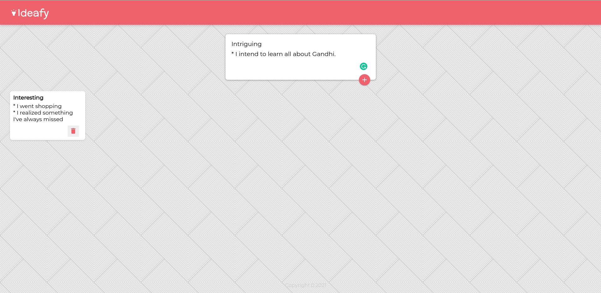

<h3 align="center">IDEAFY</h3>

<!-- TABLE OF CONTENTS -->
<details open="open">
  <summary>Table of Contents</summary>
  <ol>
    <li>
      <a href="#about-the-project">About The Project</a>
      <ul>
        <li><a href="#built-with">Built With</a></li>
      </ul>
    </li>
    <li>
      <a href="#getting-started">Getting Started</a>
      <ul>
        <li><a href="#prerequisites">Prerequisites</a></li>
        <li><a href="#installation">Installation</a></li>
      </ul>
    </li>
    <li><a href="#usage">Usage</a></li>
    <li><a href="#roadmap">Roadmap</a></li>
    <li><a href="#contributing">Contributing</a></li>
    <li><a href="#license">License</a></li>
    <li><a href="#contact">Contact</a></li>
    <li><a href="#acknowledgements">Acknowledgements</a></li>
  </ol>
</details>


<!-- ABOUT THE PROJECT -->
## About The Project



I built this to make it easier for anyone to write down ideas and take down notes wherever and whenever.
Feel free to add as many ideas as you see fit and delete them accordingly.

### Built With

This section should list any major frameworks that you built your project using. Leave any add-ons/plugins for the acknowledgements section. Here are a few examples.
* [Bootstrap](https://getbootstrap.com)
* [ReactJS](https://laravel.com)

<!-- GETTING STARTED -->
## Getting Started

Here are instructions on how you can set up the project locally.
To get a local copy up and running follow these simple steps:

### Prerequisites

Before you begin the installation process, there are a few things you'll need to set up or install first.
1. Install **npm** globally
  ```sh
  npm install npm@latest -g
  ```

### Installation

1. Clone the repo
   ```sh
   git clone https://github.com/Cadreia/ideafy.git
   ```
2. Install NPM packages
   ```sh
   npm install
   ```

<!-- CONTRIBUTING -->
## Contributing

Contributions are what make the open source community such an amazing place to be learn, inspire, and create. Any contributions you make are **greatly appreciated**.

1. Fork the Project
2. Create your Feature Branch
```sh
git checkout -b feature/AmazingFeature
  ```
3. Commit your Changes
```sh
git commit -m 'Add some AmazingFeature'
  ```
4. Push to the Branch
```sh
git push origin feature/AmazingFeature
  ```
5. Open a Pull Request


<!-- CONTACT -->
## Contact

**Name:** Audrey Ndum

**Email:** audreyndum@gmail.com

**Twitter Handle:** [@cadreia99](https://twitter.com/cadreia99)

Project Link: [https://github.com/Cadreia/ideafy.git](https://github.com/Cadreia/ideafy.git)


<!-- ACKNOWLEDGEMENTS -->
## Acknowledgements
* [Font Awesome](https://fontawesome.com)
* [Transparent Textures](https://www.transparenttextures.com/)

